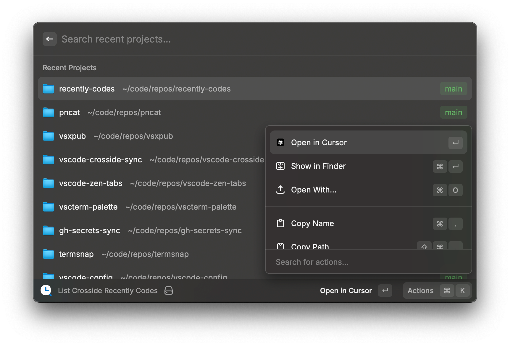

# Recently Codes

A cross-IDE solution for sharing recent project history between VSCode and its forks like Cursor and Windsurf.

## Why Recently Codes?

As developers, many of us now work with multiple code editors simultaneously. I personally use both VSCode and Cursor for different tasks, and I found it frustrating that my recent project history wasn't shared between them. Each editor maintains its own isolated history, making it difficult to quickly switch between projects across different IDEs.

Recently Codes solves this problem by providing a unified way to access and manage recent project history across multiple VSCode-based editors, enabling seamless project switching regardless of which editor you're currently using.

## Supported Editors

Currently supports the following VSCode-based editors (tested with VSCode and Cursor):

- **VSCode** (Visual Studio Code)
- **VSCode Insiders**
- **VSCodium**
- **VSCodium Insiders**
- **Cursor**
- **Windsurf**

## Installation & Usage

### VSCode Extension

The VSCode extension works with VSCode, Cursor, Windsurf, and other VSCode-compatible editors.

<p align='center'>

</p>

**Requirements:**
- **Node.js** (version 18 or higher)
- **pnpm** package manager

**Installation:**
1. Ensure Node.js and pnpm are installed on your system
2. Open VS Code or any VS Code-based editor
3. Go to the Extensions view (`Ctrl+Shift+X` or `Cmd+Shift+X`)
4. Search for "Crosside Recently Codes"
5. Click Install

**Usage:**
- Open Command Palette (`Ctrl/Cmd + Shift + P`)
- Run `Recently Codes: Install Dependencies` (recommended for first-time use to ensure runtime dependencies are installed)
- Run `Recently Codes: List Recently Codes`
- Select a project to open from any supported editor

**Configuration:**
- `crosside-recently-codes.editors`: Array of editors to scan (default: `["vscode", "cursor", "windsurf"]`)
- `crosside-recently-codes.openInNewWindow`: Open projects in new window (default: `true`)
- `crosside-recently-codes.showGitBranch`: Show Git branch information for projects (default: `false`, disabled by default due to performance impact on Windows)

### Raycast Extension

A Raycast extension for macOS users to quickly access recent projects from any supported editor.

<p align='center'>

</p>

**Installation:**
To publish to Raycast's official store, extensions must be uploaded to the `raycast/extensions` repository. However, this repository contains tons of extensions with all PRs and issues mixed together, and more importantly, I can't even clone the repository due to its size. Therefore, I don't plan to publish to their store.

For now, you can install it as a developer extension:

1. Clone this repository
2. Navigate to `packages/raycast`
3. Run `pnpm install && pnpm build`
4. Import the extension in Raycast's developer mode

**Inspiration:**
This extension was inspired by the excellent [Visual Studio Code extension](https://www.raycast.com/thomas/visual-studio-code) by Thomas Paul Mann.

**Usage:**
- Launch Raycast
- Type "List Crosside Recently Codes"
- Select and open projects from any supported editor

**Configuration:**
- Choose preferred editor to open projects
- Customize view layout (list or grid)
- Advanced section ordering options
- Show Git branch information for projects (default: `true`)

### CLI Tool

The CLI package serves a dual purpose:

1. **Electron Limitation Bypass**: VSCode and its forks run on Electron, which can have Node.js version conflicts when extensions try to access native modules. The CLI tool bypasses this by running as a separate process and returning results via stdout, avoiding version compatibility issues.

2. **Extensibility**: The CLI can be used as a building block for other software plugins or integrations that need access to recent project data.

**Installation:**
```bash
pnpm add recently-codes-cli
```

**Usage:**
```bash
# List from specific editors
recently-codes --editor cursor --editor vscode --git-branch
```

**Note:** The order of projects follows the SQL read order from each editor's history database. Since the history doesn't record opening timestamps, results are sorted by the editor's internal history array order.

## Architecture

The project is structured as a monorepo with the following packages:

- [`recently-codes`](packages/core/README.md): Core functionality for reading editor databases and processing recent files
- [`recently-codes-cli`](packages/cli/README.md): Command-line interface and process execution utilities
- [`vscode-crosside-recently-codes`](packages/vscode/README.md): VSCode extension
- [`raycast-crosside-recently-codes`](packages/raycast/README.md): Raycast extension

Each editor's recent file history is stored in SQLite databases. The core package handles reading these databases, deduplicating entries, checking file existence, and enriching data with Git branch information.

## License

[MIT](./LICENSE.md) License © [jinghaihan](https://github.com/jinghaihan)
